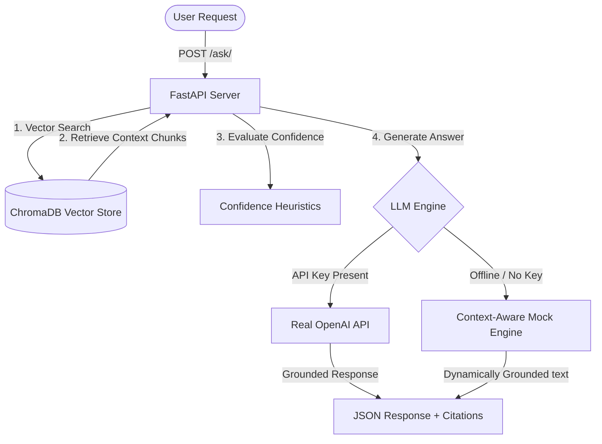

# FastAPI RAG API

A high-performance, asynchronous Retrieval-Augmented Generation (RAG) API built with FastAPI and LangChain. 

This project features a robust production-grade architecture, complete with a progressive fallback pipeline that allows the system to remain testable and operational across all stages of installation and environment setup.

## 🚀 Production Deployment & Live Demo

This application is containerized and deployed on an **AWS EC2 (Free Tier)** cloud instance using a multi-container **Docker Compose** layout.

* **🔗 Live Interactive Demo:** http://3.109.123.151:8000/docs
* **Cloud Infrastructure:** AWS EC2 Virtual Machine Architecture (`t3.micro` in ap-south-1)
* **Container Layer:** Docker Engine + Docker Compose Virtualization

### 📸 Live Production API Response (Swagger UI Verification)

Below is an authentic execution example of the live cloud-hosted server returning dynamic vector contextual mappings from a semantic knowledge query over the public internet:

```json
{
  "question": "Tell me about python",
  "answer": "Based on the provided context in python_basics.txt: Python is a high-level, interpreted programming language known for its clear syntax and emphasis on code readability. It supports multiple programming paradigms, including object-oriented, imperative, and functional programming. Common built-in data structures in Python include lists, tuples, dictionaries, and sets, which make data manipulation highly efficient. Unlike many languages that use curly braces, Python uses whitespace indentation to delimit code blocks.",
  "sources": [
    {
      "source": "python_basics.txt",
      "chunk_index": 0,
      "score": 0.7495,
      "preview": "Python is a high-level, interpreted programming language known for its clear syntax and emphasis on code readability. It supports multiple programming..."
    },
    {
      "source": "python_basics.txt",
      "chunk_index": 1,
      "score": 0.4928,
      "preview": "ke many languages that use curly braces, Python uses whitespace indentation to delimit code blocks. This clean design has made it the industry standar..."
    }
  ],
  "confidence": "medium",
  "mode": "real_retrieval+fake_llm"
}
```

---

## 🏗️ System Architecture



---

## 🛠️ Tech Stack

* **FastAPI** — High-performance, asynchronous web framework.
* **LangChain (LCEL)** — Clean declarative component chaining logic.
* **ChromaDB** — Embedded local vector database supporting persistent disk storage.
* **Sentence-Transformers (all-MiniLM-L6-v2)** — 384-dimensional dense mapping for semantic calculations.
* **Docker & Docker Compose** — Full system containerization.

---

## 🛡️ Progressive Fallback Pipeline

The API decouples structural routes from ML dependencies. The endpoint contracts never change, but the internal pipeline adapts intelligently based on your available environment packages and hardware context:

| Active Mode Pipeline | Retrieval State | Generation Engine | Description |
| --- | --- | --- | --- |
| mock_retrieval + python_mock | Hardcoded placeholders | Pure Python string interpolation | No ML dependencies installed |
| mock_retrieval + fake_llm | Hardcoded placeholders | LangChain FakeListLLM | LangChain testing layout |
| real_retrieval + fake_llm | Live ChromaDB + Real Embeddings | Context-Aware Grounded Mock Engine | Active Production Free-Tier Mode (Uses lightweight CPU-only PyTorch wheels) |
| real_retrieval + real_llm | Live ChromaDB + Real Embeddings | Grounded OpenAI API Production Layer | Full cloud generation enabled via API keys |

Check GET /ask/info at any time to inspect your active backend states.

---

## 📡 Endpoints

| Method | Path | Description |
| --- | --- | --- |
| **GET** | `/ping` | Liveness health check |
| **POST** | `/ask/` | Executes grounded RAG question answering |
| **POST** | `/search/` | Performs raw semantic similarity searches |
| **GET** | `/ask/info` | Monitors internal RAG pipeline status |
| **GET** | `/search/info` | Tracks local collection and vector stats |

---

## 📊 Confidence Heuristics

The pipeline scores match fidelity using dynamic distance metrics from the Vector Database layer to gauge response trustworthiness:

* **High:** Primary source match score >= 0.75 with a steady neighborhood document average >= 0.60.
* **Medium:** Primary source match score >= 0.50 with neighborhood document average >= 0.35.
* **Low:** Outlying semantic signals present but lacking comprehensive surrounding context.
* **None:** No viable textual data matched.

---

## 💻 Local Quick Start (Development Settings)

### 1. Environment Setup

Clone the repository and set up a virtual environment:

```bash
python -m venv venv
```

Activate the virtual environment on Windows:

```bash
venv\Scripts\activate
```

Activate the virtual environment on Linux/macOS:

```bash
source venv/bin/activate
```

Install the project dependencies:

```bash
pip install -r requirements.txt
```

### 2. Knowledge Base Ingestion

Add your source documents as `.txt` files inside the `data/` directory. Ensure all files are saved using standard **UTF-8** encoding to prevent character parsing bugs. Then, run the ingestion runner to chunk, embed, and store data natively:

```bash
python ingest.py --overwrite
```

### 3. Launch the Server Locally

```bash
uvicorn main:app --reload
```

Open **http://localhost:8000/docs** to interact with the fully documented Swagger UI interactive playground.